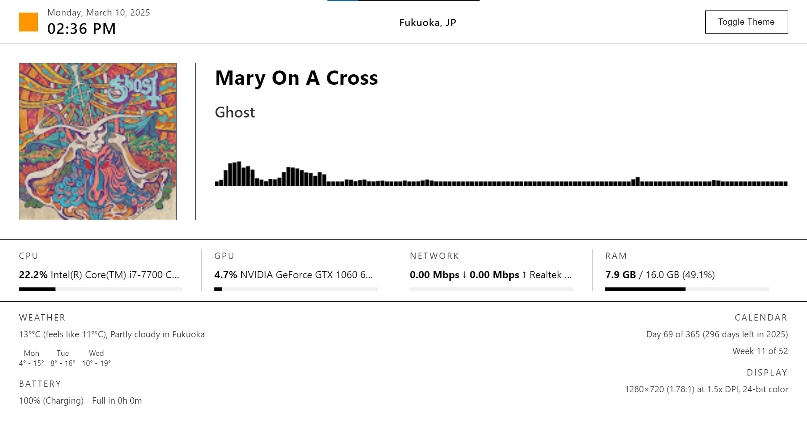
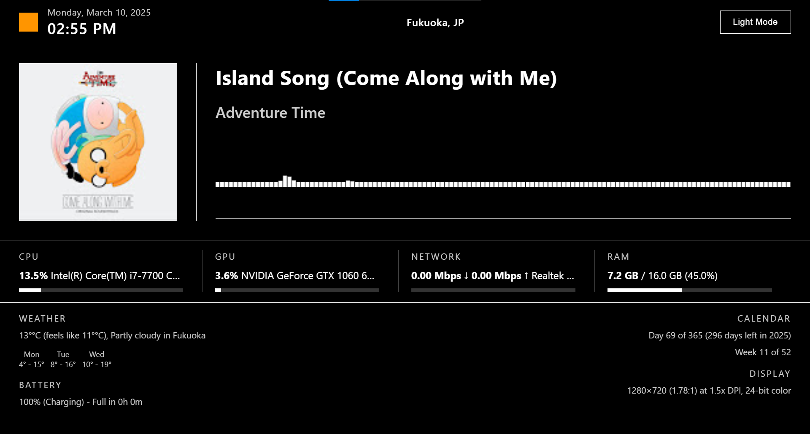

# Nezu Live Wallpaper

* [日本語](README.md)
* [English](README-en.md)

このコードは[Lively](https://github.com/rocksdanister/lively)を基に開発しています。
Livelyの制作陣の皆様に感謝の意を表します。

## 主な機能

- **時計**: 現在の時刻と日付を表示(太陽のアイコンが時間によって変化します)
- **テーマ切り替え**: ユーザーがライトテーマとダークテーマを切り替えれる
- **音楽プレーヤー**: 現在再生中のトラックの情報を表示
- **オーディオビジュアライザー**: 現在再生中の音楽の波形やスペクトルを表示
- **システム情報**: CPU、GPU、RAM、ネットワークの使用状況をリアルタイムで表示
- **天気情報**: 現在の天気と天気予報データを表示
- **バッテリー情報**: 現在のバッテリー状態を表示
- **カレンダー情報**: 現在の日付（年の日数）と週番号を表示
- **ディスプレイ情報**: 接続されているディスプレイやブラウザに関する詳細情報を表示
- **位置情報**: 現在の位置情報を表示（位置情報がない場合はプレースホルダーテキスト）

## インストール方法

1. [releaseページ](https://github.com/nezumi0627/live-wallpaper/releases)からzipファイルをダウンロード
2. zipファイルを解答して、theme.zipを取り出す
3. theme.zipをLivelyソフトに直接ドラッグ&ドロップしてインストール
4. インストールしたものをクリックして適用（この際、Livelyソフトの設定でカスタマイズからダーク/ライトモードを事前に設定することもできます（起動時に変更を引き継いだままにするため））

## スクリーンショット

## ライセンス
[MIT License](LICENSE)